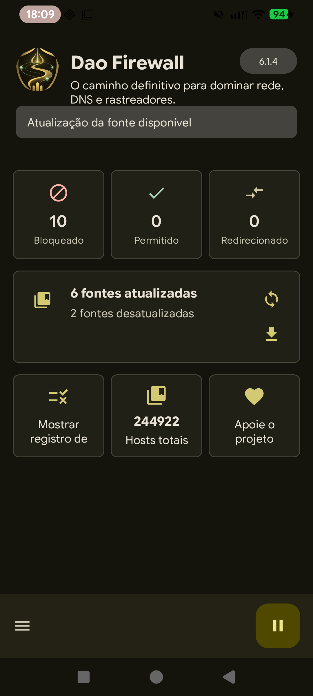
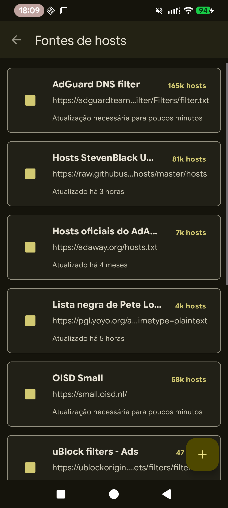
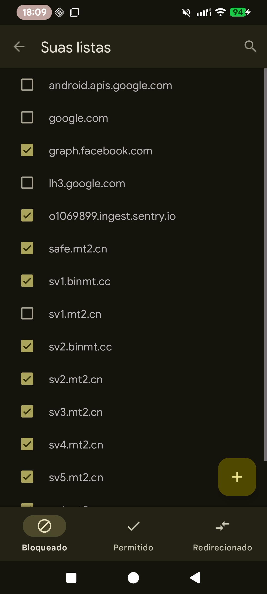
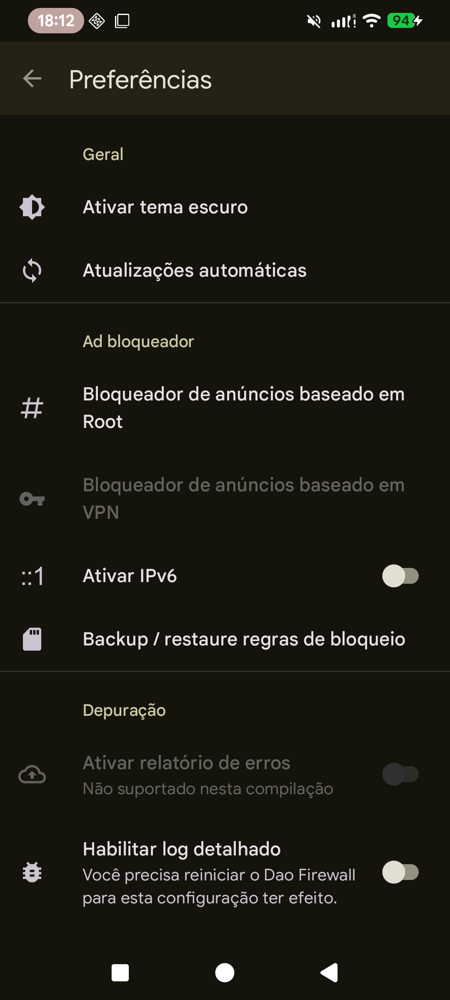
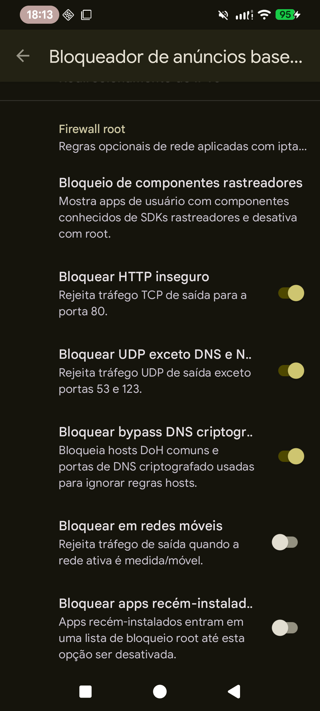
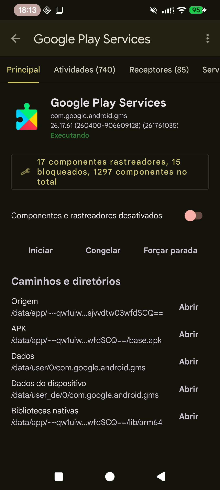
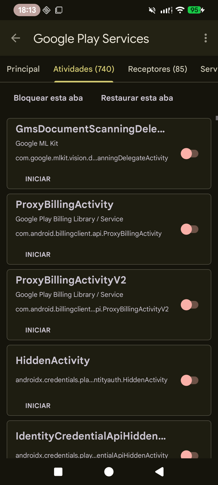
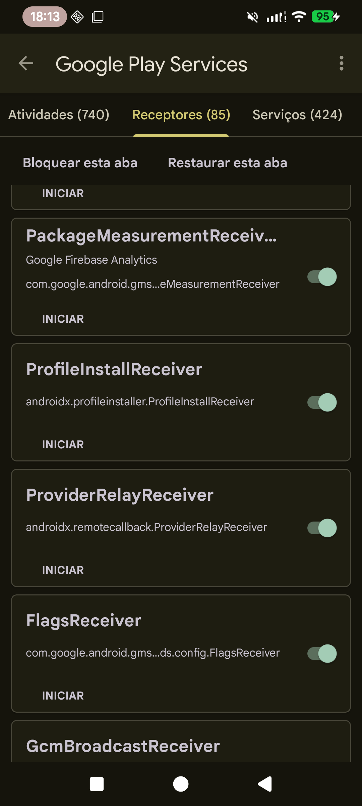

  

# Dao Firewall

**The definitive path to master network, DNS, and trackers.**

Dao Firewall is a root-focused Android firewall for controlling hosts blocking, DNS visibility, app trackers, Android components, and app data from one place. It combines systemless/root hosts deployment, DNS request logging, root firewall rules, tracker component management, and root-assisted app inspection tools.

## Screenshots

  
  
  
  
  
  
  
  

## Focus

- Root hosts blocking for modern Android systems, including systemless targets and configurable IPv4/IPv6 redirection.
- DNS request logging with quick domain blocking from observed queries.
- Personal allow/block/redirect lists, total-hosts browsing, source filtering, and large-list search.
- Hosts source management with built-in popular sources such as AdGuard DNS, StevenBlack, OISD, Pete Lowe, and compatible host-style uBlock lists.
- Root DNS proxy and tcpdump-based DNS visibility paths for stronger request capture on rooted devices.
- Root firewall rules with iptables for stricter policy, including blocking insecure TCP port 80 traffic, blocking UDP except DNS/NTP, blocking common encrypted-DNS bypass paths, mobile-network blocking, and newly installed app blocking.
- Tracker and component inspection for installed apps, including activities, receivers, services, providers, tracker counts, running/frozen indicators, and system-app visibility.
- Component control with per-item, per-tab, and all-trackers block/restore actions, plus start actions for supported activities, services, receivers, and providers.
- Root app management actions including start, freeze/unfreeze, force stop, uninstall, clear data, and clear cache.
- Root-assisted app data tools for browsing app paths/directories and opening or editing shared preferences, shared files, and SQLite databases with table browsing, SQL queries, row insert/edit/delete, and save-back support.
- Local web server support for blocked-host responses and optional self-signed certificate installation.

## Android Support

Dao Firewall is compatible with Android 16 and earlier supported Android versions.

## Root Support

Dao Firewall is designed for rooted Android setups, including Magisk, KernelSU, KernelSU forks, and other compatible root variants.

## Project Status

Dao Firewall is a personalized Android firewall project focused on root-level control, DNS visibility, and tracker management.
